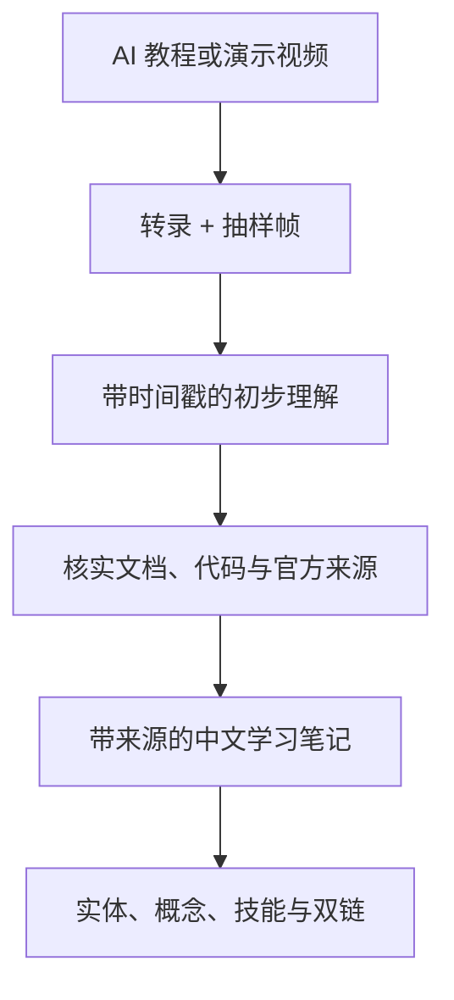

# Agent 视频理解管线

> [!tldr]
> 一种实用的视频理解方案不是把整段视频直接塞给模型，而是先拆出“听到什么”和“看到什么”：转录负责时间连续的语言证据，抽样帧负责稀疏的视觉证据，最后由多模态 Agent 对齐并综合两者。^[inferred]

## 两条互补证据流

| 证据流 | 擅长 | 容易漏掉 |
|---|---|---|
| 时间戳转录 | 论点、术语、叙事顺序、口头说明 | 幻灯片图表、界面状态、无声操作 |
| 抽样帧 | 画面布局、代码、图表、演示动作 | 帧间短暂变化、连续运动、未命中的瞬间 |

只有转录会把视频退化为音频文档；只有帧则缺少连续语义和说话上下文。两者的时间戳对齐让 Agent 可以把“讲到某一点”与“屏幕上出现什么”放在同一证据窗口中。^[inferred]

## 三个核心权衡

### 1. 时间覆盖与视觉密度

固定帧预算下，视频越长，相邻采样点越远。全片概览适合稀疏覆盖；具体问题适合聚焦时间段，而不是盲目提高全片帧数。^[inferred]

### 2. 速度与视觉选择质量

- 关键帧提取通常较快，但关键帧由视频编码结构决定，不一定对应语义事件。
- 场景变化检测更贴近画面变化，但需要解码更多内容。
- 均匀采样可以保证覆盖，却可能重复静止画面或错过短暂事件。

### 3. 本地处理与云端转录

下载、字幕提取、抽帧和去重可以在本地完成；Whisper API 能补无字幕视频，但形成了明确的音频外传边界。隐私敏感资料应允许关闭云端回退。^[inferred]

## 典型失败模式

- 自动字幕错误被模型当成事实。
- 场景几乎不变，但屏幕文字局部变化，去重阈值错误地删除关键帧。
- 快速弹窗或单帧异常没有落入采样点。
- 长视频问题过于宽泛，导致视觉证据稀疏却给出过度确定的结论。
- 视频内容本身缺少来源，模型只能忠实总结错误信息。

因此，视频理解结果应带时间戳、说明转录来源，并把“视频里说了什么”与“这是否真实”分成两个判断。^[inferred]

## 在 AI 学习知识库中的位置

[[entities/Claude-Video]] 可以承担第二步，但第四步仍需要 [[skills/Codex学习工作流]] 中的检索与来源审阅。也就是说，视频分析是采集和理解增强，不是事实核查的替代品。^[inferred]

## Related

- [[entities/Claude-Video]] — 这一管线的具体开源实现。
- [[skills/使用-Claude-Video-分析视频]] — 面向 Codex 的操作策略。
- [[references/Claude-Video-GitHub仓库]] — 当前机制描述的主要来源。
- [[entities/Obsidian-Web-Clipper]] — 对网页型来源的互补采集入口。

## Sources

- [[references/Claude-Video-GitHub仓库]]
- [Claude Video README](https://github.com/bradautomates/claude-video)
