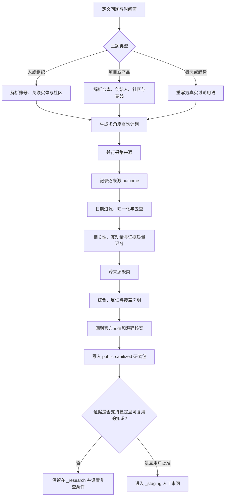

# 多源时效研究管线

> [!tldr]
> 多源时效研究不是把同一个关键词丢给很多搜索引擎，而是先确定“谁、在哪些社区、用什么语言讨论”，再并行采集不同类型的信号，保留每个来源的真实运行状态，最后按证据簇综合。它回答“最近发生了什么和人们如何反应”，但不能单独证明事实。

## 为什么单一搜索不够

不同来源回答的问题不同：

| 来源类型 | 主要信号 | 常见偏差 |
|---|---|---|
| 官方文档 / release | 已发布事实与第一方定义 | 很少反映真实使用摩擦 |
| GitHub | 提交、issue、release、stars 与开发活动 | stars 不等于采用质量，issue 也可能有选择偏差 |
| Reddit / HN | 长讨论、反对意见、实践经验 | 社区人口和版规塑造观点 |
| X / Threads | 第一方动态和即时反应 | 传播速度快，语境短，机器人与情绪放大明显 |
| YouTube / TikTok / Instagram | 长解释、演示、创作者与受众反应 | 观看量不等于正确，转录可能遗漏画面或识别错误 |
| 预测市场 | 对可判定结果的概率和变化 | 市场设计、流动性和参与者结构影响价格 |
| 普通 Web | 新闻、评测、教程与长期背景 | SEO、转载和发布时间不等于事件发生时间 |

真正的价值来自互补：GitHub 证明“正在发布什么”，社区讨论说明“使用者遇到什么”，视频补充演示语境，预测市场提供有约束的概率信号，正式来源负责最后核实。^[inferred]

## 管线阶段

该图以 Last30Days v3.16.0 为主要实例抽象出通用步骤；最后的官方核实、研究包审计和人工晋升是当前 AI-wiki 工作流增加的质量门。^[inferred]

## 四个关键机制

### 1. 先解析实体，再搜关键词

同名人物、项目和品牌会污染关键词搜索。解析官方 X handle、GitHub 用户或仓库、相关社区和创作者，可以把搜索从“包含这些字”提升为“确实围绕这个实体”。

### 2. 保存来源状态，而不只保存结果数

`0 results` 只有在来源成功执行时才意味着“没有发现”。若状态是超时、限流、鉴权失败、schema drift 或未配置，就只能说覆盖不完整。这个区分是避免错误否定结论的核心。

### 3. 聚类比来源分栏更接近问题

同一事件可能同时出现在 GitHub release、Reddit 讨论、X 公告和 YouTube 评测中。按故事或主题聚类能显示哪些结论得到独立来源印证，也能暴露只有单一来源支持的薄弱信号。

### 4. 互动量是排序信号，不是真值函数

高赞、高播放和高评论意味着值得读，不等于内容正确。推荐类问题还要提高实践者证词、可测量结果、专家公开转向和理由充分的横向比较权重；事实类问题则要回到官方或原始来源。

## 可复用的质量检查

- 时间窗是否依据实际发布日期，而不是网页更新时间或抓取时间？
- 每个来源是成功、无结果，还是没有正常运行？
- 高互动内容是否与目标实体真正相关？
- 结论是否至少有两个独立来源，还是单一平台回声？
- 引用的是原始帖子/视频/代码，还是二手摘要？
- 推荐排序依据是证据质量，还是简单提及次数？
- 关键事实是否已回到 release、文档、源码或正式数据核实？
- 原始结果、查询计划和补充网页能否被未来复查？

## 在 AI-wiki 中的用法

1. 使用 `$ai-research` 把多源研究产物写入 `_research/` 的公开清理研究包，不直接当成最终知识。
2. 在 `sources.jsonl` 记录来源运行状态，在 `claims.jsonl` 把支持证据、反证、置信度和未解决冲突绑定到具体主张。
3. 近期数字注明检索日期，并在 `decision.md` 设置复查条件；结构校验与语义验收分别报告。
4. 只有完成官方核实和本机验证后，才把“项目声明支持”升级为“当前环境已验证”。
5. 只有用户明确批准后，才把稳定实体或可复用方法交给 `_staging/`，再建立 entity、concept 或 skill 页面。

这些规则把 Last30Days 的时效信号与 [[skills/Codex学习工作流]] 的来源审计结合起来。^[inferred]

## Related

- [[entities/Last30Days-Skill]]
- [[references/Last30Days-Skill-GitHub仓库]]
- [[skills/使用-Last30Days-进行近期研究]]
- [[skills/Codex学习工作流]]
