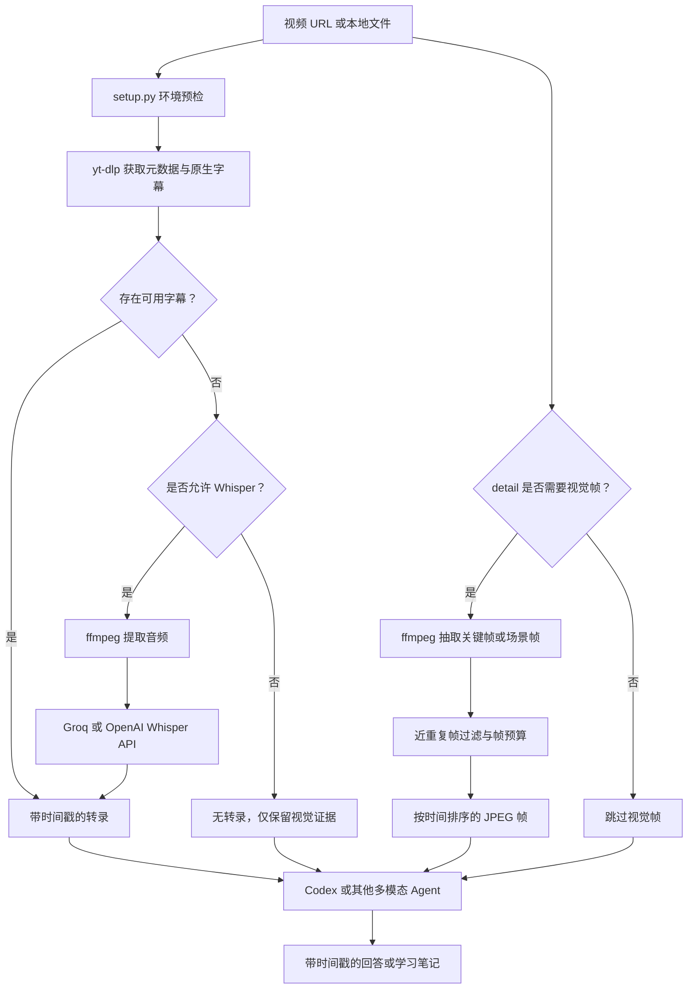

# Claude Video

> [!tldr]
> Claude Video 不是视频模型，也不是 Obsidian 插件；它是一个名为 `watch` 的 Agent Skill。它把视频预处理成转录文本与代表性帧，再让 Codex、Claude Code 等具备图像理解能力的宿主模型完成问答和总结。

## 它解决什么问题

只有转录文本时，幻灯片、界面变化、演示操作和视觉细节会丢失；逐帧读取完整视频又会产生很高的计算与上下文成本。Claude Video 的折中是：

1. 优先获取带时间戳的原生字幕；
2. 按 detail 模式抽取关键帧或场景变化帧；
3. 去除近重复帧并限制帧预算；
4. 把转录和帧一起交给宿主模型。

这个设计是 [[concepts/Agent-视频理解管线|Agent 视频理解管线]] 的一个具体实现。

## 数据流

> [!note] 图的证据属性
> 该图根据仓库 README 与 `skills/watch/SKILL.md` 重绘，节点组合和分支表达属于结构化整理。^[inferred]

## 四种 detail 模式

| 模式 | 视觉输入 | 默认上限 | 适合场景 |
|---|---|---:|---|
| `transcript` | 不取帧 | 0 | 先快速了解演讲、播客或教程结构 |
| `efficient` | 关键帧 | 50 | 需要低延迟的视觉抽样 |
| `balanced` | 场景变化帧 | 100 | 默认折中方案 |
| `token-burner` | 场景变化帧 | 不设硬上限 | 视觉变化密集且愿意承担高 token 成本 |

“默认上限”来自 v0.2.0 上游说明，不是本机性能保证。

## 适合的学习场景

- 把 AI 教程视频整理成有时间戳的中文学习笔记。
- 同时理解演讲内容与幻灯片、代码、界面操作。
- 对演示视频中的某一时段做针对性问答。
- 从屏幕录制中定位出现问题的视觉时刻。

对于本知识库，分析结果仍应进入 [[skills/Codex学习工作流]] 的来源核实、蒸馏和审阅步骤；“运行过视频 skill”不能自动等同于“内容已经可靠”。^[inferred]

## 限制与风险

- **长视频覆盖变稀**：有上限的模式会把有限帧分散到全片；问题集中在某一时段时，应使用 `--start` 与 `--end`。
- **字幕并不等于事实**：自动字幕可能识别错误，视频作者本身也可能说错。
- **抽帧不是逐帧观看**：短暂出现的 UI、代码或字幕可能落在采样点之间。
- **外部数据流**：无原生字幕并启用 Whisper 时，提取音频会发送到 Groq 或 OpenAI。
- **宿主差异**：上游以 `/watch` 作为统一名称，但 Codex 中应按本机 skills 触发规则使用 `$watch` 或明确点名 skill。^[inferred]

## 本机状态

- 2026-07-16 核实的上游最新发布为 v0.2.0。
- `python`、`ffmpeg`、`ffprobe`、`yt-dlp`、`node`、`npx` 已存在。
- `watch` skill 尚未安装，因此没有做视频运行、模型回答质量或 API 数据流的端到端验收。
- 如果决定安装，应先阅读 [[skills/使用-Claude-Video-分析视频]] 中的隐私选择与最小测试方案。

## Sources

- [[references/Claude-Video-GitHub仓库]]
- [Upstream repository](https://github.com/bradautomates/claude-video)
