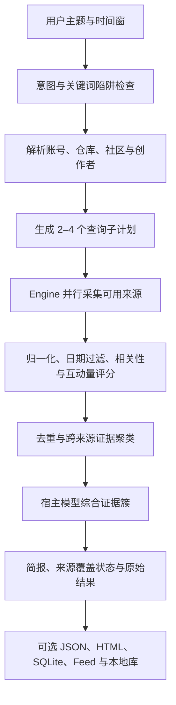

# Last30Days Skill GitHub 仓库

> [!tldr]
> `mvanhorn/last30days-skill` 不是一个“帮模型搜索最近新闻”的短提示词，而是一个长篇 Agent 合约加 Python 检索引擎。它要求宿主先解析实体和社区，再并行抓取多平台信号、按互动量与相关性排序、跨来源聚类，最后生成带覆盖状态的近期研究简报。

## 当前快照

| 项目 | 2026-07-16 核实结果 |
|---|---|
| 仓库 | [mvanhorn/last30days-skill](https://github.com/mvanhorn/last30days-skill) |
| 固定提交 | `249c7a4c040558a903d6838dee31012980d4946d` |
| 最新 release | [v3.16.0](https://github.com/mvanhorn/last30days-skill/releases/tag/v3.16.0) |
| package / plugin version | `3.16.0` |
| 许可证 | MIT |
| GitHub 快照 | 52,376 stars；4,579 forks；65 open issues |
| 实现规模快照 | 85 个 Python 库模块；199 个测试文件；3,115 个测试函数 |
| Codex 分发入口 | `.codex-plugin/plugin.json` → `skills/` |
| Skill 入口 | `skills/last30days/SKILL.md` |
| Engine 入口 | `skills/last30days/scripts/last30days.py` |

## 它实际由什么组成

官方 `CONCEPTS.md` 把产品分成三层：

- **Skill**：分发单元，由 `SKILL.md` 与 `scripts/` 构成。
- **Engine**：执行检索、评分、聚类、渲染和持久化的 Python 程序。
- **Harness**：Codex、Claude Code 等加载和遵循 Skill 合约的宿主。

这一区分很重要：只阅读 README 后自行搜索，会跳过实体解析、查询计划、Engine 输出、来源覆盖状态和固定 footer，因此不等于使用了这个 Skill。

## 搜索与综合主路径

图中“宿主解析 + Engine 执行”的双层结构来自 Skill 合约和代码入口；节点组合是知识库为便于理解所做的结构化重绘。^[inferred]

## 来源不是同时无条件可用

| 层级 | 典型来源 | 启用条件或边界 |
|---|---|---|
| 公开 / keyless | Reddit 公开路径、HN、Polymarket、StockTwits | HN 与 Polymarket 无密钥；Reddit 会使用公开、RSS、抓取或回退路径；StockTwits 只在金融主题激活 |
| 本地 CLI | YouTube、Digg、arXiv、Techmeme、Trustpilot | 分别依赖 `yt-dlp`、printing-press CLIs；Trustpilot 默认不自动安装 |
| 凭据 / cookie | X、TikTok、Instagram、Threads、Pinterest、LinkedIn、Bluesky、Truth Social | 依赖浏览器会话、API Key 或 app password；必须按来源检查 |
| 请求式本地服务 | 小红书 | 需要已登录的本地浏览器会话服务，并显式 `--search xhs` 或配置包含该来源 |
| Web / 推理供应商 | Brave、Exa、Serper、Parallel、Perplexity、OpenRouter 等 | 可选 Key；宿主原生 WebSearch 也是补充通道 |
| 私有本地语料 | Markdown、TXT、可选 PDF | `--corpus` / `LAST30DAYS_CORPUS_DIRS`；稳定 Agent JSON 与托管发布默认排除语料内容 |

因此“支持某平台”应理解为代码存在适配器和启用路径，而不是每次运行都成功覆盖该平台。可信结论必须读取每次运行的 `source_status`，区分成功、无结果、部分、限流、鉴权失败、超时和未配置。

## v3.16.0 的关键变化

- YouTube 评论优先走 `yt-dlp` 免费路径，ScrapeCreators 只在失败时回退。
- `GITHUB_TOKEN` 接入配置、Keychain、setup 和 doctor。
- 允许按来源覆盖结果上限，支持 `OPENROUTER_BASE_URL`，并修正 MCP timeout 的整数秒格式。
- 修复 keyless web 被 DuckDuckGo 异常拦截时的 Startpage 回退、Reddit 二次抓取失败污染整个 Web 来源、Windows/Node 24 Bird 输出、空值排序、非 ASCII URL 和超长主题文件名等问题。

## 输出与持久化能力

- 默认生成 Markdown 研究快照，并在用户 Documents 下的 `Last30Days` 目录保存原始结果。
- `--emit=json` 提供版本化 Agent JSON；`--json-profile=raw` 是不稳定的内部结构。
- `--discover` 用于无主题趋势发现；`--drill` 针对缓存报告中的某个证据簇做深入研究。
- `--store` 把跨次结果写入 SQLite；`watchlist.py` 与 `briefing.py` 支持定时追踪和简报。
- `library feed` 生成本地 HTML 索引与 Atom feed；只有显式 `--publish` 才上传到 `ht-ml.app`，且公开是默认发布状态。
- `doctor`、`doctor --probe` 与 `doctor --postmortem` 分别面向配置预测、有限实时探测和上次运行复盘。

## 权限与隐私边界

- 首次 setup 可能安装额外 CLI、写入 `~/.config/last30days/.env`，并在获得同意后读取浏览器中的 X cookie。
- 查询和内容可能发送给 ScrapeCreators、X/xAI/Xquik、OpenAI、Brave、Perplexity 等外部服务；具体取决于本次启用的来源与 provider。
- `LAST30DAYS_API_KEY` + `LAST30DAYS_API_BASE` 会把研究切换到用户配置的远端后端；配置本地 corpus 时，规范要求绕过远端后端以免发送文件内容。
- `--preflight` 是安装后首次运行前最合适的只读入口；应先核对 cookie 计划、endpoint override、计划写入和被忽略的项目配置，再决定是否 setup。
- “不记录 API Key”“cookie 仅在同意后读取”等是上游规范与静态代码审计结果；本次未执行第三方 Engine，不能把这些声明写成已通过本机运行验证。

## 本机准备度（未安装、未运行）

| 项目 | 当前状态 |
|---|---|
| `last30days` Skill | 未在本机全局 Skill 目录发现 |
| Python | `3.11.9`，低于项目要求的 `3.12+` |
| `uv` | 已存在；上游 preflight 声明可自动供应 3.12，但本次未执行该路径 |
| Node / npx | `24.12.0` / `11.6.2` |
| `yt-dlp` | 已存在，版本 `2026.06.09` |
| `gh` | 已存在，版本 `2.85.0` |
| Digg / arXiv / Techmeme / Trustpilot CLI | 未发现 |
| `~/.config/last30days/.env` | 不存在 |

本次只完成固定提交的来源审计和本机依赖盘点，没有安装、setup、cookie 读取、API 调用、研究运行、测试执行或发布。

## 证据限制

- stars、forks、issues 是时点数据，不是质量结论。
- 3,115 是测试函数静态计数，不代表本机测试已通过；84% coverage gate 来自仓库配置，不是本次测量。
- README 的“zero config”“no tracking”等属于项目声明；需实际安装后通过 `--preflight`、最小研究、输出文件检查和 `doctor --postmortem` 验证。
- `docs/how-search-works.md` 的部分 Reddit/OpenAI 描述与当前多后端实现存在版本层次差异，应以 v3.16.0 `SKILL.md`、`CONFIGURATION.md` 和实际代码为主。

## 关联页面

- [[entities/Last30Days-Skill]] — 产品定位、组件与适用边界。
- [[concepts/多源时效研究管线]] — 可复用的多来源近期研究机制。
- [[skills/使用-Last30Days-进行近期研究]] — 面向 Codex 的安全安装与验收流程。
- [[skills/Codex学习工作流]] — 第三方 Agent 项目进入知识库时的总工作流。

## Sources

- Raw archive: `_raw/_archived/mvanhorn-last30days-skill-v3.16.0-source-packet.md`
- [Repository README](https://github.com/mvanhorn/last30days-skill/blob/249c7a4c040558a903d6838dee31012980d4946d/README.md)
- [`skills/last30days/SKILL.md` in fixed tree](https://github.com/mvanhorn/last30days-skill/tree/249c7a4c040558a903d6838dee31012980d4946d/skills/last30days)
- [Configuration and changelog in fixed tree](https://github.com/mvanhorn/last30days-skill/tree/249c7a4c040558a903d6838dee31012980d4946d)
- [v3.16.0 release](https://github.com/mvanhorn/last30days-skill/releases/tag/v3.16.0)
