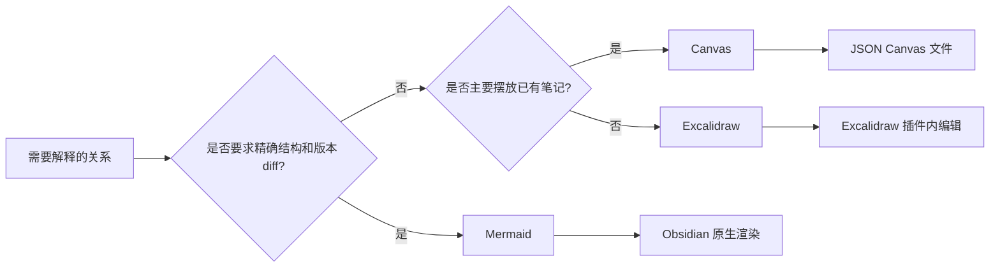

# Codex 主导的 AI 学习工作流

## 1. 网页或论文 → 可追溯中文学习笔记

1. Web Clipper 或 PDF 保存原始来源及 canonical URL。
2. Codex 使用 AnySearch 核实作者、版本和关键事实。
3. `wiki-ingest` 生成 reference、concept 和 entity 页面；推断标记 `^[inferred]`。
4. Mermaid 表达结构化机制；只有需要自由布局时才用 Excalidraw。
5. 页面进入 `_staging/`，人工核对原文、图表和结论后再推广。

## 2. AI 第三方库或 Agent 项目 → 可复用知识

1. 以官方文档、GitHub 仓库、release 和最小代码样例为主来源。
2. entity 页面说明“它是什么”；concept 页面说明原理；skill 页面说明可重复操作。
3. 记录版本范围和真实运行边界，不把 README 的能力声明当作已验证支持。
4. 使用 Bases 展示库名、版本、用途、状态、来源和复查日期。

## 3. 复杂机制 → 合适的视觉载体

## 4. 已积累笔记 → 检索、综合与复习

1. 先用 index、Properties、Bases、Search 和 `wiki-query`。
2. 用 `wiki-status` 和 `wiki-lint` 找孤儿页、陈旧核心页、链接与 frontmatter 问题。
3. 用 `wiki-synthesize` 生成跨来源结论，人工确认后推广。
4. 当规模或具体症状出现，再引入 Omnisearch 或 Spaced Repetition；不要预装。

## 验收问题

- 每个重要结论能否回到具体来源？
- 页面是否包含自己的解释、反例或开放问题，而非只复制摘要？
- 图是否真的降低理解成本？
- 停用某个插件后，核心文字和链接是否仍然可读？
